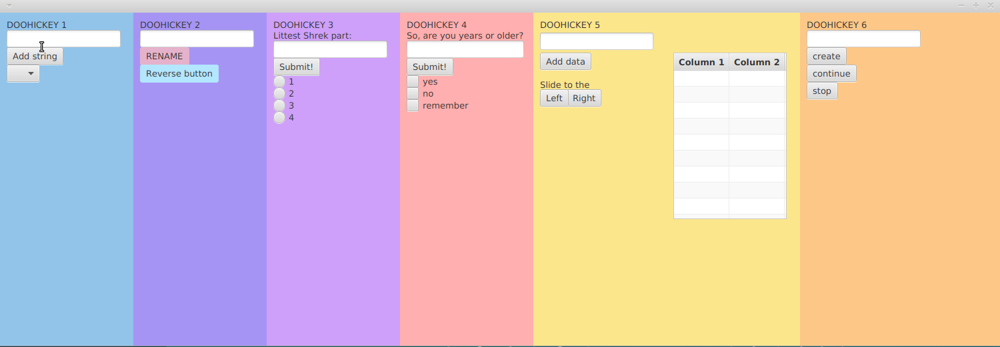

**Жирко М. С. гр. 821701**
_lib: **_JavaFx_** Ind.Task №14_ 
> **_./gradelew run_** to run the program 

# Software in Intellectual Systems
## 1st lab
### Requirements:
The purpose was to learn the basics of JavaFx library. And as the result this application was created...\
Each _**Doohickey**_ stands for special task.
#### Purpose of _Doohickey 1_:
Includes the string, typed at the _TextField_, to the _ComboBox_ as the _Button_ is pressed.
#### Purpose of _Doohickey 2_:
Renames _**lower** Button_ after _**upper** Button_ is pressed. Reverses _Buttons_ as the _**lower** Button_ is pressed.
> String to rename _Buttons_ is assigned in the _TextField_.
#### Purpose of _Doohickey 3_:
Strikes off _RadioGroup_ object assigned in the _TextField_ by pressing _Button_.
#### Purpose of _Doohickey 4_:
Strikes off _CheckBox_ object assigned in the _TextField_ by pressing _Button_.
#### Purpose of _Doohickey 5_:
Writes to the _Table_ the string, assigned by pressing the _Button **Add**_. Then changes string allocation in _Table_ by pressing _**left**_ and _**right**_ _Button_.
#### Purpose of _Doohickey 6_:
Creates _RadioGroups_ which is equal to the **number** typed at the _TextField_. By pressing the _first Button_, each object of _RadioGroup_ is emitted in series. _**Stop** Button_ stops that process, _**continue** Button_ continues emission.
### Demo

_That's about all..._
